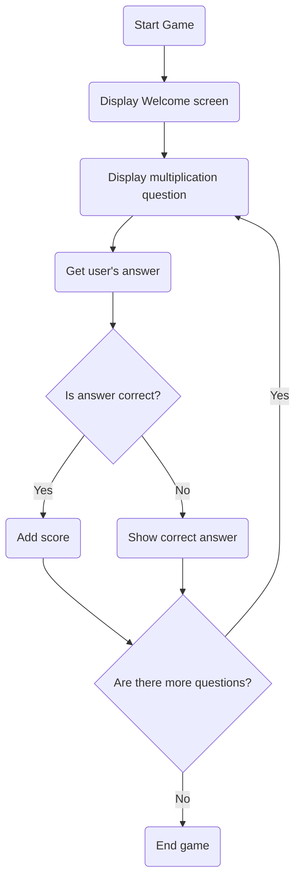

# capstone-lesson-7

```mermaid
flowchart TD
    A(Start Game) --> B(Display Welcome screen)
    B --> C(Display multiplication question)
    C --> D(Get user's answer)
    D --> E{Is answer correct?}
    E -- Yes --> F(Add score)
    E -- No --> G(Show correct answer)
    F --> H{Are there more questions?}
    G --> H
    H -- Yes --> C
    H -- No --> I(End game)
```
